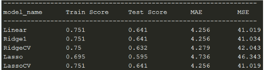
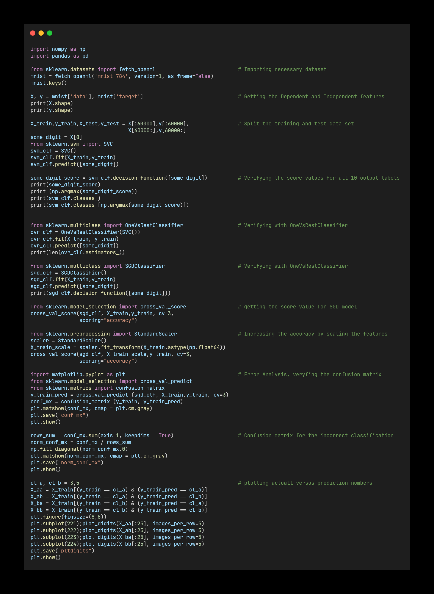
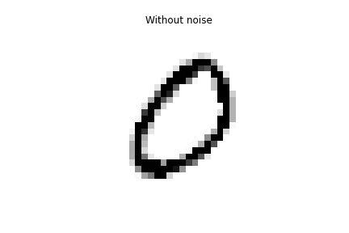

## About
Python implementations of some of the fundamental Machine Learning models and algorithms from scratch.

The purpose of this project is not to produce as optimized and computationally efficient algorithms as possible but rather to present the inner workings of them in a transparent and accessible way.

---
### Day 1

Ordinary Linear Regression:

Linear Regression is a relatively simple method that is extremely widely-used. It is also a great stepping stone for more sophisticated methods, making it a natural algorithm to study first. A regression analysis is simply a method of estimating the relationship between a dependent variable and a set of independent variables.

Have understood and implemented the Linera regression by using a concept of minimizing the loss and maximizing the likelihood.

---
### Day 2

Gradient descent is an optimization algorithm used to minimize some function by iteratively moving in the direction of steepest descent as defined by the negative of the gradient. In machine learning, we use gradient descent to update the parameters of our model.
I have implementated a simple gradient descent to understand the behavior based on different learning rates and momentum

 

---
### Day 3

Ridge and Lasso are two of the most important regularization techniques in linear regression. Both of them solve the problems of plain-old LR by introducing some bias leading to lower variance and thus avoiding overfitting. The hyperparameter lambda controls how severe the regularization is for features with different magnitudes.

I have understood the math behind the these regularization techniques and implemented them and presented there score, MSA and MSE.

 

---
### Day 4

Classifier is a supervised learning algorithm thats attemps to identify an observation belongs to one or more groups. The most commonly used discriminative and generative classification models are Logistic Regression, Perceptron Algorithm and Fisher's Linear Discriminant.

I have understood the model structure and parameters estimiation for all these algorithms and implemented them by training different datasets.

---
### Day 5

A Discriminative model as we saw in previous post models the decision boundary between the classes. A Generative Model ‌explicitly models the actual distribution of each class. In final both of them is predicting the conditional probability P(Animal | Features). But Both models learn different probabilities. A Generative Model ‌learns the joint probability distribution p(x,y). It predicts the conditional probability with the help of Bayes Theorem. A Discriminative model ‌learns the conditional probability distribution p(y|x).

I have gained an insight into Joint Probability vs Conditional Probability, Generative VS Discriminative Models and Naive bayes algorithm and compared it with discriminative models LDA and QDA.

---
### Day 6

Decision Trees are a non-parametric supervised learning method used for classification and regression. Decision trees learn from data to approximate a sine curve with a set of if-then-else decision rules. The deeper the tree, the more complex the decision rules and the fitter the model. Decision tree builds classification or regression models in the form of a tree structure. Decision trees can handle both categorical and numerical data.

I have demonstrated how to fit regression and decision trees and also gained deep understanding on Hyperparameters like Size Regulation, Minimum Reduction in RSS and Pruning (Pre and post) and other key factors like Entropy, Information gain, Impurity of a node and various algorithms likes ID3, CART, C4.5

---
### Day 7

Tree Ensemble Bagging - Due to their high variance, decision trees often fail to reach a level of precision comparable to other predictive algorithms. Ensemble methods combine the output of multiple simple models, often called “learners”, in order to create a final model with lower variance. Bagging, short for bootstrap aggregating, combines the results of several learners trained on bootstrapped samples of the training data. The process of bagging is very simple yet often quite powerful.

For a given dataset created a bagging model which trains many learners on bootstrapped samples of the training data and aggregates the results into one final model and have also outlined the behaviour for different number of bootstraps each time fitting a decision tree regressor.

---
### Day 8

When we are learning Machine learning it is best to experiment with real world data and not artificial datasets. I have used "California housing price" dataset here and have explored the dataset in details and gained an understanding on framing the problem based on he required business objective and also perceived other notions like pipelining (Sequence of Data processing components), selection of performance measure line RMSE, MSE, downloading the data, getting a quick look of the data structure and simple creation of test and train dataset manually.

---
### Day 9

The train-test split procedure is used to estimate the performance of machine learning algorithms when they are used to make predictions on data not used to train the model. It is a fast and easy procedure to perform, the results of which allow you to compare the performance of machine learning algorithms for your predictive modeling problem.

It can be used for classification or regression problems and can be used for any supervised learning algorithm. I have performed various train-test split procedure like cyclic redundancy check, spli based on identifier column and also other methods like StratifiedShuffleSplit (skewed data) and train_test_split by using sklearn library and verified the proportion of test randomly picked matches with the proportion of actual dataset.

---
### Day 10

Data visualization is the representation of data or information in a graph, chart, or other visual format. It communicates relationships of the data with images. This is important because it allows trends and patterns to be more easily seen and visual summary of information makes it easier to identify patterns and trends than looking through thousands of rows on a spreadsheet. It’s the way the human brain works.

The goal is to go into little more depth and I have tried to discover and visualize the data to gain insight. Visualized the geographical data based on different attributes by spotting the patterns. Also Verified the correlation between the attributes and transformed them to get better insight.

---
### Day 11

Data cleansing or data cleaning is the process of detecting and correcting corrupt or inaccurate records from a record set, table, or database and refers to identifying incomplete, incorrect, inaccurate or irrelevant parts of the data and then replacing, modifying, or deleting the dirty or coarse data.

In order to really seek to understanding on Data cleasing, have performed various activities like performing data cleaning manually and also by using libraries. Have understood the design principles like "Estimators", "Transformers" and "Predictors". Performed various encoding techniques on numerical and Categorical attributes and executed a simple pipeline for tranformation of attributes.

---
### Day 12

For any given machine learning problem, numerous algorithms can be applied and multiple models can be generated. Having a wealth of options is good, but deciding on which model to implement in production is crucial. Though we have a number of performance metrics to evaluate a model, it’s not wise to implement every algorithm for every problem. This requires a lot of time and a lot of work. So it’s important to know how to select the right algorithm for a particular task.

By looking at the factors of the dataset, I have select 3 different models and refined my selection based on accuracy scores. I have also understood the various techniques to fine tune the model like "Grid search" and "Randomized Search" and identified the best hyper parameter tuning parameters and used the final model to evaluate the test set.

---
### Day 13

Classification is the process of recognizing, understanding, and grouping ideas and objects into preset categories or “sub-populations.” Using pre-categorized training datasets, machine learning programs use a variety of algorithms to classify future datasets into categories. Classification algorithms in machine learning use input training data to predict the likelihood that subsequent data will fall into one of the predetermined categories.

I have achieved understanding on various helper function and performed a simple Binary Image classification by using some simple classifiers like SGD and measured accuracy using cross validation technique and also made aware that impact of skewed data on accuracy performance measure.

---
### Day 14

In the field of machine learning and specifically the problem of statistical classification, a confusion matrix, also known as an error matrix, is a specific table layout that allows visualization of the performance of an algorithm. The extended ersion of the confusion matrix are classification measures which help in better understanding and analysis of model performance.

Using sklearn library have understood and implemented key learnings like precision, recall, F1 score, sensitivity, specificity etc. which are helpful in deciding the right model. Have also gained an insight on the precision various plots like precision curve at all classification threshold and ROC curve. Also compared different ROC curves to understand how different models are capable of distinguishing between classes.

---
### Day 15

In machine learning, multiclass or multinomial classification is the problem of classifying instances into one of three or more classes (classifying instances into one of two classes is called binary classification).

Have performed multiclass classification using various algotithm and used confusion matrix to summarise the performance of classification and peformed improvement in the performance by performing scaling on train data.

---
### Day 16

Multiclass classification is used when there are three or more classes and the data we want to classify belongs exclusively to one of those classes, e.g. to classify if a semaphore on an image is red, yellow or green. Multilabel classification support can be added to any classifier with Multioutput Classifier. This strategy consists of fitting one classifier per target. This allows multiple target variable classifications.

---
### Day 17

In statistics, linear regression is a linear approach to modelling the relationship between a scalar response and one or more explanatory variables. It is one of the easiest topics in data science. With linear regression, you can get the correlation between two sets of variables, the independent variable(s) and the dependent variable.

I have familiarize myself with the math used by the model and interpret some common variables in the regression.

---
### Day 18

Optimization is a big part of machine learning. Almost every machine learning algorithm has an optimization algorithm at it’s core. Gradient descent is an optimization algorithm used to find the values of parameters (coefficients) of a function (f) that minimizes a cost function (cost). There are three popular types of gradient descent that mainly differ in the amount of data they use: "Batch Gradient Descent", "Stochastic Gradient Descent" and "Mini-Batch Gradient Descent"

I have implemented a batch and stochastic gradience descent to understand the impact of learning rate and also understand the match behind it.

---
### Day 19

We have seen the Batch Gradient Descent in the previous post. We have also seen the Stochastic Gradient Descent. Batch Gradient Descent can be used for smoother curves. SGD can be used when the dataset is large.	Mini batch is used to tackle this problem faces in Batch and Stochastic, a mixture of Batch Gradient Descent and SGD is used. I have created a plot which gives a view Gradient Descent paths in parameter space

Which one to use? well, all the three variants we saw have their advantages as well as disadvantages. It’s not like the one variant is used frequently over all the others. Every variant is used uniformly depending on the situation and the context of the problem.

Next topic is Polynomial regression technique which is used by the professionals to predict the outcome. It is defined as the relationship between the independent and dependent variables when the dependent variable is related to the independent variable having an nth degree. I have converted the original features into their higher order terms we will use the PolynomialFeatures class provided by scikit-learn. Next, we train the model using Linear Regression.

---
### Day 20

Polynomial provides the best approximation of the relationship between the dependent and independent variable. A Broad range of function can be fit under it. Polynomial basically fits a wide range of curvature. To get a polynomial equation, we have to transform the linear regression by adding power to the independent variable, that is by adding the degree to the independent variables which will turn a linear regression model into a curve. Implemented my understanding by plotting the best fit line for various degress.

The cause of poor performance in machine learning is either due to overfitting or underfitting the data. Further down to interpretate the model accomplishment, have created a learning curve by plotting model performance over experience or time for both train and test data set. This is performed using different models to illustrate, how different models impact the performance. 

Overfitting: Good performance on the training data, poor generliazation to other data.
Underfitting: Poor performance on the training data and poor generalization to other data 

---
### Day 21
Regularization is a form of regression, that constrains/ regularizes or shrinks the coefficient estimates towards zero. In other words, this technique discourages learning a more complex or flexible model, so as to avoid the risk of overfitting. There are multiple different forms of constraints that we could use to regularize. The three most popular ones are Ridge Regression, Lasso, and Elastic Net.

An alternative approach is to train the model once for a large number of training epochs. During training, the model is evaluated on a holdout validation dataset after each epoch. If the performance of the model on the validation dataset starts to degrade (e.g. loss begins to increase or accuracy begins to decrease), then the training process is stopped.

---
### Day 22
Logistic regression is a statistical model that in its basic form uses a logistic function to model a binary dependent variable, although many more complex extensions exist. In regression analysis, logistic regression (or logit regression) is estimating the parameters of a logistic model (a form of binary regression).

Softmax Regression is a generalization of logistic regression that we can use for multi-class classification (under the assumption that the classes are mutually exclusive). From the example provided it can be seen that the output a softmax function is equal to the number of classes. These outputs are indeed equal to the probabilities of each class and so they sum up to one. 

---
### Day 23

A support vector machine (SVM) is a supervised machine learning model that uses classification algorithms for classification problems. Compared to newer algorithms like neural networks, they have two main advantages: higher speed and better performance with a limited number of samples. This makes the algorithm very suitable for text classification problems, where it’s common to have access to a dataset of at most a couple of thousands of tagged samples.

The basics of Support Vector Machines and how it works is understood by implementing simple examples and understanding there impact on scaling and outliers.

