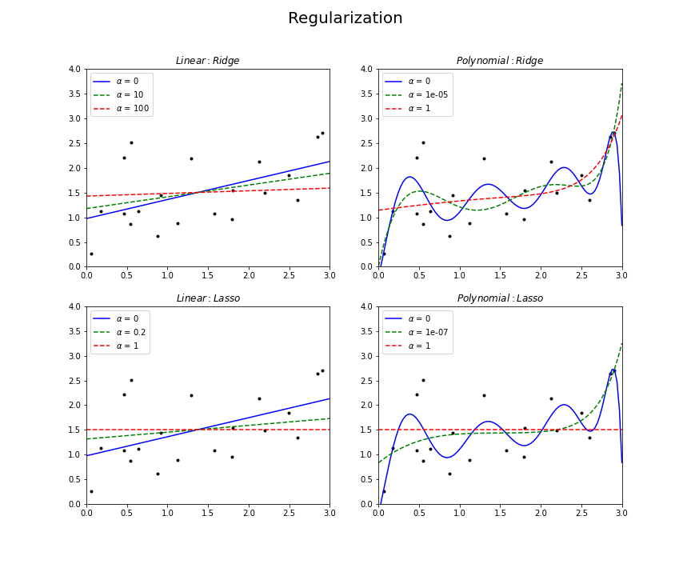
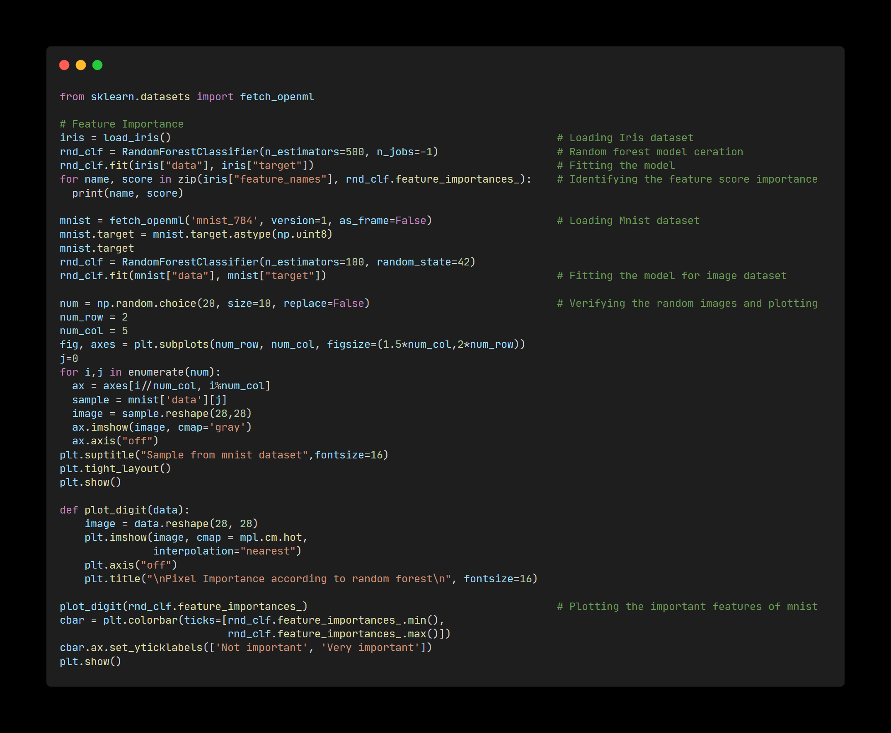
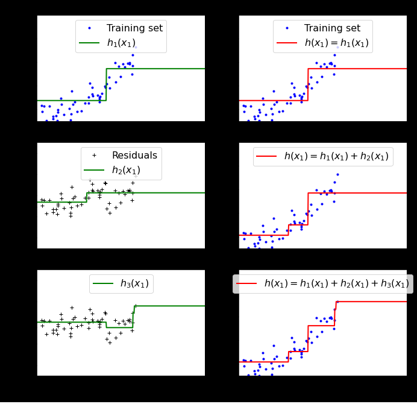

## About
Python implementations of some of the fundamental Machine Learning models and algorithms from scratch.

The purpose of this project is not to produce as optimized and computationally efficient algorithms as possible but rather to present the inner workings of them in a transparent and accessible way.

---
### Day 1

Ordinary Linear Regression:

Linear Regression is a relatively simple method that is extremely widely-used. It is also a great stepping stone for more sophisticated methods, making it a natural algorithm to study first. A regression analysis is simply a method of estimating the relationship between a dependent variable and a set of independent variables.

Have understood and implemented the Linera regression by using a concept of minimizing the loss and maximizing the likelihood.

---
### Day 2

Gradient descent is an optimization algorithm used to minimize some function by iteratively moving in the direction of steepest descent as defined by the negative of the gradient. In machine learning, we use gradient descent to update the parameters of our model.
I have implementated a simple gradient descent to understand the behavior based on different learning rates and momentum

 

---
### Day 3

Ridge and Lasso are two of the most important regularization techniques in linear regression. Both of them solve the problems of plain-old LR by introducing some bias leading to lower variance and thus avoiding overfitting. The hyperparameter lambda controls how severe the regularization is for features with different magnitudes.

I have understood the math behind the these regularization techniques and implemented them and presented there score, MSA and MSE.

 

---
### Day 4

Classifier is a supervised learning algorithm thats attemps to identify an observation belongs to one or more groups. The most commonly used discriminative and generative classification models are Logistic Regression, Perceptron Algorithm and Fisher's Linear Discriminant.

I have understood the model structure and parameters estimiation for all these algorithms and implemented them by training different datasets.

---
### Day 5

A Discriminative model as we saw in previous post models the decision boundary between the classes. A Generative Model ‌explicitly models the actual distribution of each class. In final both of them is predicting the conditional probability P(Animal | Features). But Both models learn different probabilities. A Generative Model ‌learns the joint probability distribution p(x,y). It predicts the conditional probability with the help of Bayes Theorem. A Discriminative model ‌learns the conditional probability distribution p(y|x).

I have gained an insight into Joint Probability vs Conditional Probability, Generative VS Discriminative Models and Naive bayes algorithm and compared it with discriminative models LDA and QDA.

---
### Day 6

Decision Trees are a non-parametric supervised learning method used for classification and regression. Decision trees learn from data to approximate a sine curve with a set of if-then-else decision rules. The deeper the tree, the more complex the decision rules and the fitter the model. Decision tree builds classification or regression models in the form of a tree structure. Decision trees can handle both categorical and numerical data.

I have demonstrated how to fit regression and decision trees and also gained deep understanding on Hyperparameters like Size Regulation, Minimum Reduction in RSS and Pruning (Pre and post) and other key factors like Entropy, Information gain, Impurity of a node and various algorithms likes ID3, CART, C4.5

---
### Day 7

Tree Ensemble Bagging - Due to their high variance, decision trees often fail to reach a level of precision comparable to other predictive algorithms. Ensemble methods combine the output of multiple simple models, often called “learners”, in order to create a final model with lower variance. Bagging, short for bootstrap aggregating, combines the results of several learners trained on bootstrapped samples of the training data. The process of bagging is very simple yet often quite powerful.

For a given dataset created a bagging model which trains many learners on bootstrapped samples of the training data and aggregates the results into one final model and have also outlined the behaviour for different number of bootstraps each time fitting a decision tree regressor.

---
### Day 8

When we are learning Machine learning it is best to experiment with real world data and not artificial datasets. I have used "California housing price" dataset here and have explored the dataset in details and gained an understanding on framing the problem based on he required business objective and also perceived other notions like pipelining (Sequence of Data processing components), selection of performance measure line RMSE, MSE, downloading the data, getting a quick look of the data structure and simple creation of test and train dataset manually.

---
### Day 9

The train-test split procedure is used to estimate the performance of machine learning algorithms when they are used to make predictions on data not used to train the model. It is a fast and easy procedure to perform, the results of which allow you to compare the performance of machine learning algorithms for your predictive modeling problem.

It can be used for classification or regression problems and can be used for any supervised learning algorithm. I have performed various train-test split procedure like cyclic redundancy check, spli based on identifier column and also other methods like StratifiedShuffleSplit (skewed data) and train_test_split by using sklearn library and verified the proportion of test randomly picked matches with the proportion of actual dataset.

---
### Day 10

Data visualization is the representation of data or information in a graph, chart, or other visual format. It communicates relationships of the data with images. This is important because it allows trends and patterns to be more easily seen and visual summary of information makes it easier to identify patterns and trends than looking through thousands of rows on a spreadsheet. It’s the way the human brain works.

The goal is to go into little more depth and I have tried to discover and visualize the data to gain insight. Visualized the geographical data based on different attributes by spotting the patterns. Also Verified the correlation between the attributes and transformed them to get better insight.

---
### Day 11

Data cleansing or data cleaning is the process of detecting and correcting corrupt or inaccurate records from a record set, table, or database and refers to identifying incomplete, incorrect, inaccurate or irrelevant parts of the data and then replacing, modifying, or deleting the dirty or coarse data.

In order to really seek to understanding on Data cleasing, have performed various activities like performing data cleaning manually and also by using libraries. Have understood the design principles like "Estimators", "Transformers" and "Predictors". Performed various encoding techniques on numerical and Categorical attributes and executed a simple pipeline for tranformation of attributes.

---
### Day 12

For any given machine learning problem, numerous algorithms can be applied and multiple models can be generated. Having a wealth of options is good, but deciding on which model to implement in production is crucial. Though we have a number of performance metrics to evaluate a model, it’s not wise to implement every algorithm for every problem. This requires a lot of time and a lot of work. So it’s important to know how to select the right algorithm for a particular task.

By looking at the factors of the dataset, I have select 3 different models and refined my selection based on accuracy scores. I have also understood the various techniques to fine tune the model like "Grid search" and "Randomized Search" and identified the best hyper parameter tuning parameters and used the final model to evaluate the test set.

---
### Day 13

Classification is the process of recognizing, understanding, and grouping ideas and objects into preset categories or “sub-populations.” Using pre-categorized training datasets, machine learning programs use a variety of algorithms to classify future datasets into categories. Classification algorithms in machine learning use input training data to predict the likelihood that subsequent data will fall into one of the predetermined categories.

I have achieved understanding on various helper function and performed a simple Binary Image classification by using some simple classifiers like SGD and measured accuracy using cross validation technique and also made aware that impact of skewed data on accuracy performance measure.

---
### Day 14

In the field of machine learning and specifically the problem of statistical classification, a confusion matrix, also known as an error matrix, is a specific table layout that allows visualization of the performance of an algorithm. The extended ersion of the confusion matrix are classification measures which help in better understanding and analysis of model performance.

Using sklearn library have understood and implemented key learnings like precision, recall, F1 score, sensitivity, specificity etc. which are helpful in deciding the right model. Have also gained an insight on the precision various plots like precision curve at all classification threshold and ROC curve. Also compared different ROC curves to understand how different models are capable of distinguishing between classes.

---
### Day 15

In machine learning, multiclass or multinomial classification is the problem of classifying instances into one of three or more classes (classifying instances into one of two classes is called binary classification).

Have performed multiclass classification using various algotithm and used confusion matrix to summarise the performance of classification and peformed improvement in the performance by performing scaling on train data.

---
### Day 16

Multiclass classification is used when there are three or more classes and the data we want to classify belongs exclusively to one of those classes, e.g. to classify if a semaphore on an image is red, yellow or green. Multilabel classification support can be added to any classifier with Multioutput Classifier. This strategy consists of fitting one classifier per target. This allows multiple target variable classifications.

---
### Day 17

In statistics, linear regression is a linear approach to modelling the relationship between a scalar response and one or more explanatory variables. It is one of the easiest topics in data science. With linear regression, you can get the correlation between two sets of variables, the independent variable(s) and the dependent variable.

I have familiarize myself with the math used by the model and interpret some common variables in the regression.

---
### Day 18

Optimization is a big part of machine learning. Almost every machine learning algorithm has an optimization algorithm at it’s core. Gradient descent is an optimization algorithm used to find the values of parameters (coefficients) of a function (f) that minimizes a cost function (cost). There are three popular types of gradient descent that mainly differ in the amount of data they use: "Batch Gradient Descent", "Stochastic Gradient Descent" and "Mini-Batch Gradient Descent"

I have implemented a batch and stochastic gradience descent to understand the impact of learning rate and also understand the match behind it.

---
### Day 19

We have seen the Batch Gradient Descent in the previous post. We have also seen the Stochastic Gradient Descent. Batch Gradient Descent can be used for smoother curves. SGD can be used when the dataset is large.	Mini batch is used to tackle this problem faces in Batch and Stochastic, a mixture of Batch Gradient Descent and SGD is used. I have created a plot which gives a view Gradient Descent paths in parameter space

Which one to use? well, all the three variants we saw have their advantages as well as disadvantages. It’s not like the one variant is used frequently over all the others. Every variant is used uniformly depending on the situation and the context of the problem.

Next topic is Polynomial regression technique which is used by the professionals to predict the outcome. It is defined as the relationship between the independent and dependent variables when the dependent variable is related to the independent variable having an nth degree. I have converted the original features into their higher order terms we will use the PolynomialFeatures class provided by scikit-learn. Next, we train the model using Linear Regression.

---
### Day 20

Polynomial provides the best approximation of the relationship between the dependent and independent variable. A Broad range of function can be fit under it. Polynomial basically fits a wide range of curvature. To get a polynomial equation, we have to transform the linear regression by adding power to the independent variable, that is by adding the degree to the independent variables which will turn a linear regression model into a curve. Implemented my understanding by plotting the best fit line for various degress.

The cause of poor performance in machine learning is either due to overfitting or underfitting the data. Further down to interpretate the model accomplishment, have created a learning curve by plotting model performance over experience or time for both train and test data set. This is performed using different models to illustrate, how different models impact the performance. 

Overfitting: Good performance on the training data, poor generliazation to other data.
Underfitting: Poor performance on the training data and poor generalization to other data 

---
### Day 21
Regularization is a form of regression, that constrains/ regularizes or shrinks the coefficient estimates towards zero. In other words, this technique discourages learning a more complex or flexible model, so as to avoid the risk of overfitting. There are multiple different forms of constraints that we could use to regularize. The three most popular ones are Ridge Regression, Lasso, and Elastic Net.

An alternative approach is to train the model once for a large number of training epochs. During training, the model is evaluated on a holdout validation dataset after each epoch. If the performance of the model on the validation dataset starts to degrade (e.g. loss begins to increase or accuracy begins to decrease), then the training process is stopped.

---
### Day 22
Logistic regression is a statistical model that in its basic form uses a logistic function to model a binary dependent variable, although many more complex extensions exist. In regression analysis, logistic regression (or logit regression) is estimating the parameters of a logistic model (a form of binary regression).

Softmax Regression is a generalization of logistic regression that we can use for multi-class classification (under the assumption that the classes are mutually exclusive). From the example provided it can be seen that the output a softmax function is equal to the number of classes. These outputs are indeed equal to the probabilities of each class and so they sum up to one. 

---
### Day 23

A support vector machine (SVM) is a supervised machine learning model that uses classification algorithms for classification problems. Compared to newer algorithms like neural networks, they have two main advantages: higher speed and better performance with a limited number of samples. This makes the algorithm very suitable for text classification problems, where it’s common to have access to a dataset of at most a couple of thousands of tagged samples.

The basics of Support Vector Machines and how it works is understood by implementing simple examples and understanding there impact on scaling and outliers.

---
### Day 24

In real-world tasks it is often difficult to determine the appropriate function that makes a training sample linearly separable in feature space, even if one happens to find a function that makes the training set linearly separable in feature space, it is difficult to conclude that the seemingly linear result is not due to overfitting.One way to alleviate this problem is to allow the support vector machine to make errors on some sample. Linearly separable then only our hyperplane is able to distinguish between them and if any outlier is introduced then it is not able to separate them. So these type of SVM is called as hard margin SVM and this loeads to over fitting. In real life scenario, we need an update so that our function may skip few outliers and be able to classify almost linearly separable points. For this reason we need soft margin.

To handle different kind of data, SVM algorithms use different types of kernel functions. These functions can be different types. For example linear, nonlinear, polynomial, radial basis function (RBF), and sigmoid.

---
### Day 25

In Support Vector machine non-linear datasets, Radial Basis Function (RBF) Kernel can be used as a savior. RBF kernels are the most generalized form of kernelization and is one of the most widely used kernels due to its similarity to the Gaussian distribution. 

We all know that Support Vector Machines (SVM) are popularly and widely used for classification problems in machine learning. Support Vector Machine can also be used as a regression method, maintaining all the main features that characterize the algorithm (maximal margin). The Support Vector Regression (SVR) uses the same principles as the SVM for classification, with only a few minor differences. 

---
### Day 26

A decision tree is a decision support tool that uses a tree-like model of decisions and their possible consequences, including chance event outcomes, resource costs, and utility. It is one way to display an algorithm that only contains conditional control statements. A popular way to solve this problem, especially if using an ID3 algorithm, is to use entropy and information gain. Decision trees can be a useful machine learning algorithm to pick up nonlinear interactions between variables in the data.

To avoid overfitting the training data, ristrictions can be applied to the Decision Tree during training. Some of the important hyperparameters are min samples split, min samples leaf, max leaf nodes, max features

---
### Day 27

Decision Tree is one of the most commonly used, practical approaches for supervised learning. It can also be used for Classification tasks. The decision of making strategic splits heavily affects a tree’s accuracy. The decision criteria is different for classification and regression trees.Decision trees regression normally use mean squared error (MSE) to decide to split a node in two or more sub-nodes. For each subset, it will calculate the MSE separately. The tree chooses the value with results in smallest MSE value.	

Decision trees have an advantage that it is easy to understand, lesser data cleaning is required, non-linearity does not affect the model’s performance, however Over fitting is one of the most practical difficulty for decision tree models. This problem gets solved by setting constraints on model parameters and pruning. Small variations in the data might result in a completely different tree being generated. This is called variance, which needs to be lowered by methods like bagging and boosting.

---
### Day 28

Ensemble methods is a machine learning technique that combines several base models in order to produce one optimal predictive model. Ensemble methods can be divided into two groups: first one is Sequential ensemble methods where the base learners are generated sequentially (e.g. AdaBoost) and second one is Parallel ensemble methods where the base learners are generated in parallel (e.g. Random Forest).
 
Bagging stands for bootstrap aggregation. One way to reduce the variance of an estimate is to average together multiple estimates. Bagging is an ensemble algorithm that fits multiple models on different subsets of a training dataset, then combines the predictions from all models. Random forest, is an extension of Bagging and like its name implies, consists of a large number of individual decision trees that operate as an ensemble. Each individual tree in the random forest spits out a class prediction and the class with the most votes. In classification, a hard voting ensemble involves summing the votes for crisp class labels from other models and predicting the class with the most votes. A soft voting ensemble involves summing the predicted probabilities for class labels and predicting the class label with the largest sum probability. For regression, a voting ensemble involves making a prediction that is the average of multiple other regression models.

---
### Day 29

One of the method of measuring the prediction error of random forests, boosted decision trees, and other machine learning models utilizing bootstrap aggregating (bagging). Bagging uses subsampling with replacement to create using only the trees that did not have training samples for the model to learn from. OOB error is the mean prediction error on each training sample in their bootstrap.

Random forest also has differnt kinds of sampling techniques during baggin process which includes Random Subspace and Random Patches. The random subspace method is a technique used in order to introduce variation among the predictors in an ensemble model. This is done as decreasing the correlation between the predictors increases the performance of the ensemble model. The random subspace method is also known as feature or attribute bagging. When the random subspace method is used along with bagging or pasting it is known as the random patches method. Sampling features results in greater diversity among the predictors and this is the reason why the random subspace method and the random patches method are used.
 

---
### Day 30

Adaboost is a type of ensemble technique, where a number of weak learners are combined together to form a strong learner. Here, usually, each weak learner is developed as decision stumps (A stump is a tree with just a single split and two terminal nodes) that are used to classify the observations. Adaboost increases the predictive accuracy by assigning weights to both observations at end of every tree and weights to every classifier.

Just like AdaBoost, Gradient Boost also combines a no. of weak learners to form a strong learner. Here, the residual of the current classifier becomes the input for the next consecutive classifier on which the trees are built, and hence it is an additive model. By this method, we are slowly inching in the right direction towards better prediction

---
### Day 31

Gradient boosting is an ensembling technique where several weak learners (regression trees) are combined to yield a powerful single model, in an iterative fashion. Early stopping support in Gradient Boosting enables us to find the least number of iterations which is sufficient to build a model that generalizes well to unseen data. When each additional stage of regression tree is added, the validation set is used to score the model. This is continued until the scores of the model in the last stages do not improve. After that the model is considered to have converged and further addition of stages is “stopped early”.

XGBoost is one of the most popular and efficient implementations of the Gradient Boosted Trees algorithm, a supervised learning method that is based on function approximation by optimizing specific loss functions as well as applying several regularization techniques.

---
### Day 32

Stacking or Stacked Generalization is an ensemble machine learning algorithm. It uses a meta-learning algorithm to learn how to best combine the predictions from two or more base machine learning algorithms. The benefit of stacking is that it can harness the capabilities of a range of well-performing models on a classification or regression task and make predictions that have better performance than any single model in the ensemble.

Dimensionality Reduction: Having a large number of dimensions in the feature space can mean that the volume of that space is very large. This can dramatically impact the performance of machine learning algorithms fit on data with many input features, generally referred to as the “curse of dimensionality”. This reduces the number of dimensions of the feature space, hence the name “dimensionality reduction.”

To address nonlinear relationships within the data, we can turn to a class of methods known as manifold learning—a class of unsupervised estimators that seeks to describe datasets as low-dimensional manifolds embedded in high-dimensional spaces. Below are some of the intersting journals for reference:

---
### Day 33

Principal Component Analysis (PCA) is by far the most popular dimensionality reduction algorithm. First it identifies the hyperplane that lies closest to the data, and then it projects the data onto it. By definition, the top PCs capture the dominant factors of heterogeneity in the data set. Thus, we can perform dimensionality reduction by restricting downstream analyses to the top PCs. This strategy is simple, highly effective and widely used throughout the data sciences

How many of the top PCs should we retain for downstream analyses? The choice of the number of PCs d is a decision that is analogous to the choice of the number of features to use. Using more PCs will retain more data. Most practitioners will simply set d to a “reasonable” but arbitrary value, typically ranging from 10 to 50. This is often satisfactory as the later PCs explain so little variance that their inclusion or omission has no major effect.

---
### Day 34

Once the dimensionality reduction is performed the training set takes up much less space by reducing the number of features and preserving the 95% of variance. So while most of the variance is preserved, the dataset is now less than some percentage less than its original size. It is also possible to decompress the reduced dataset back to original dimensions by applying the inverse transformation of the PCA projection. This will not give us back the original data, since the projection lost a bit of informationn (5% variance that was dropped), But it is still close to the original data. The mean squared distance between the original data and the reconstructed data (compressed and then decompressed) is called the reconstruction error.

PCA might give you the best projection for some initial training data but it might become arbitrarily worse as time goes by and new data arrives with an "evolved" distribution. Random projections gives you a kind of probabilistic warranty against that situation. 

One problem with the preceding implementations of PCA is that they require the whole training set to fit in memory in order for the algorithm to run. Fortunately,
Incremental PCA (IPCA) algorithms have been developed: you can split the training set into mini-batches and feed an IPCA algorithm one mini-batch at a time. This is useful for large training sets, and also to apply PCA online (i.e., on the fly, as new instances arrive).

---
### Day 35

The PCA transformations we described previously are linear transformations. The process of matrix decomposition into eigenvectors is a linear transformation. In other words, each principal component is a linear combination of the original wavelengths. Kernel PCA was developed in an effort to help with the classification of data whose decision boundaries are described by non-linear function. The idea is to go to a higher dimension space in which the decision boundary becomes linear.

There are different ways to perform kernal PCA like Linear, poly, rbf, sigmoid, cosine, precomputed. The general approach to select an optimal kernel (either the type of kernel, or kernel parameters) in any kernel-based method is cross-validation. 

